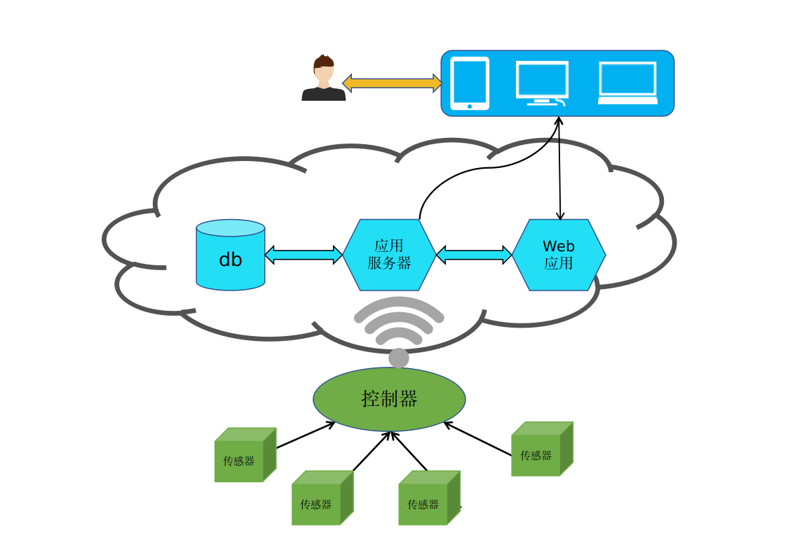
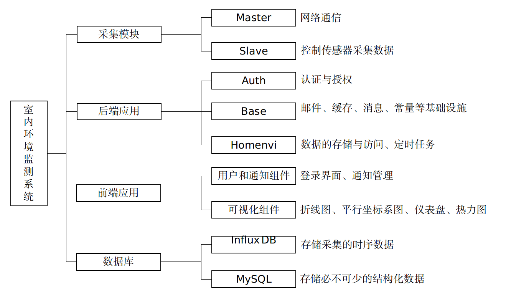
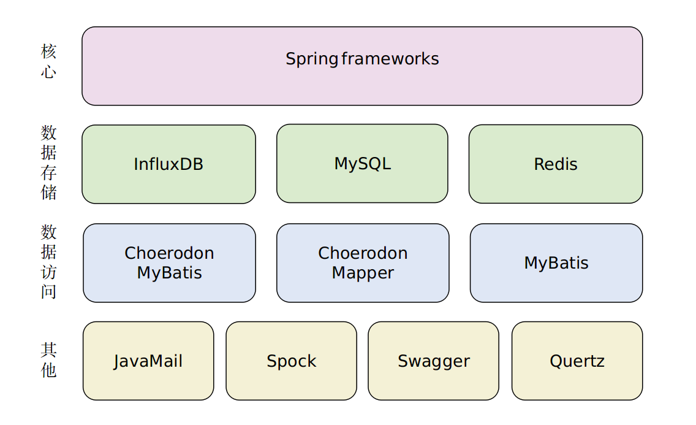

[TOC]

# Homenvi室内环境监控系统

## 概述

此项目实现一个简单的物联网应用系统，通过Arduino微控制器结合多种传感器监测家庭生活中影响生活质量的各项参数，包括温度、湿度、噪声、光线强度、烟雾、家庭常见有毒气体（甲醛、煤气、天然气）、PM2.5等；然后将采集的数据通过WIFI上传到云端的服务器上进行存储分发并以Web的形式进行图形化展示，同时提供多种方式（邮件、站内信）的通知和预警，让用户对家庭生活的各项指标尽在掌握；最后再通过对数据的统计分析，周期性地为用户提供较为全面的有关生活质量的报告及建议。

> What is Homenvi?
>
> 我简单粗暴的把家和环境这两个单词组合在一起作为我这个工程的名称。即：
>
> Homenvi = Home + Environment

## 总体架构

整个应用按功能和用途划分成采集模块、后端应用、前端应用和数据库，组成情况及功能如下图所示：

## 采集模块

参见[Homenvi-collector](https://github.com/TTcheng/homenvi-collector)

## 后端应用

### 后端概述

后端应用是整个系统的控制中心，控制着数据的来龙去脉。此模块又分为Auth、Base和Homenvi三个子模块，分别负责认证与授权、提供基础设施组件和领域业务流的控制。

- Auth子模块

此模块负责用户的认证与授权，目前仅实现了用户的认证，这主要包括通过加密算法判断此用户是否有合法的通行证（Token是否有效或用户名与密码是否匹配）。 Base子模块

- Base子模块

此模块为业务流的构建提供了大量常用或通用的基础设施，包括应用的配置管理，常量管理，统一的异常处理，统一的日志管理，通用的工具组件，邮件服务、缓存服务和国际化消息服务，以及所有控制器类需要继承的基类和几乎每个数据实体都依赖的基础实体等等。

- Homenvi子模块

此模块为领域（室内环境监测系统）元素的集合，它包含该领域的所有实体以及它们的业务和服务。具体来说包括三个方面，其一是面向持久化层进行交互，如对采集的数据对象的存取，以及其衍生的结构化数据对象（如产生的通知、报表、历史记录等）的增删改查；其二是控制业务流的走向，为其他主模块提供（采集模块、前端应用）可操作的接口；其三是任务调度，如定时产生某个周期内的环境监测报告，周期性监控采集的数据以提供实时预警。

### 技术栈

### environment

jdk 1.8

## 前端应用

参见[homenvi-front](https://github.com/TTcheng/homenvi-front)